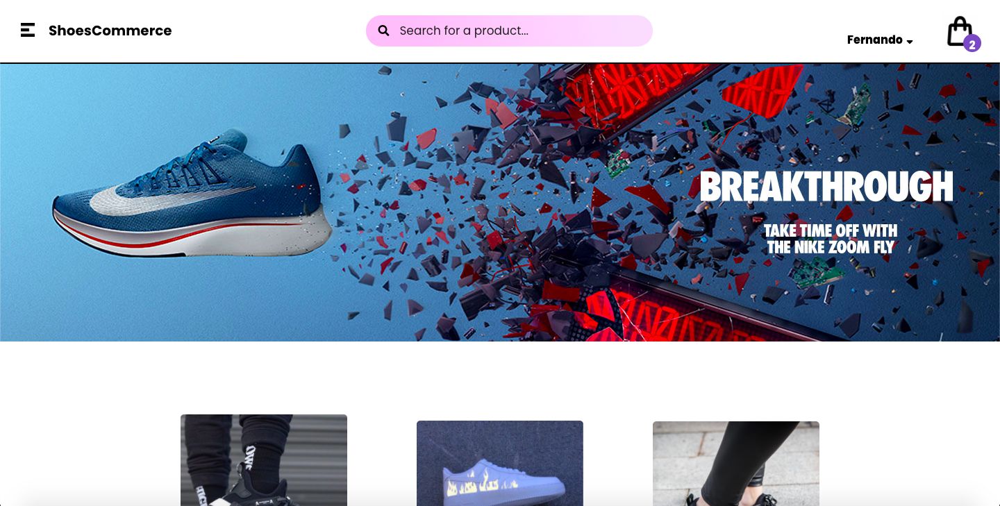
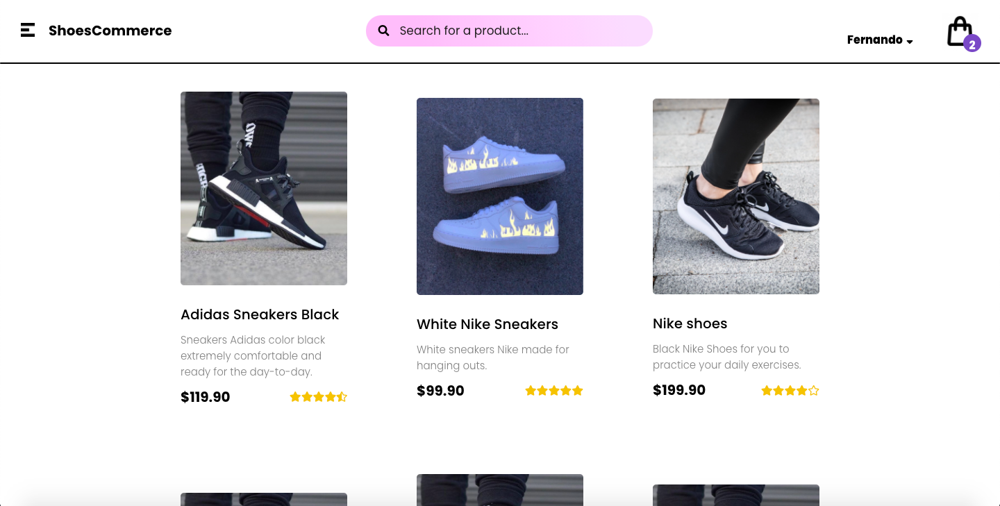
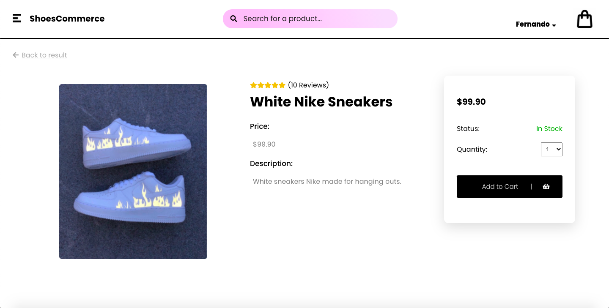
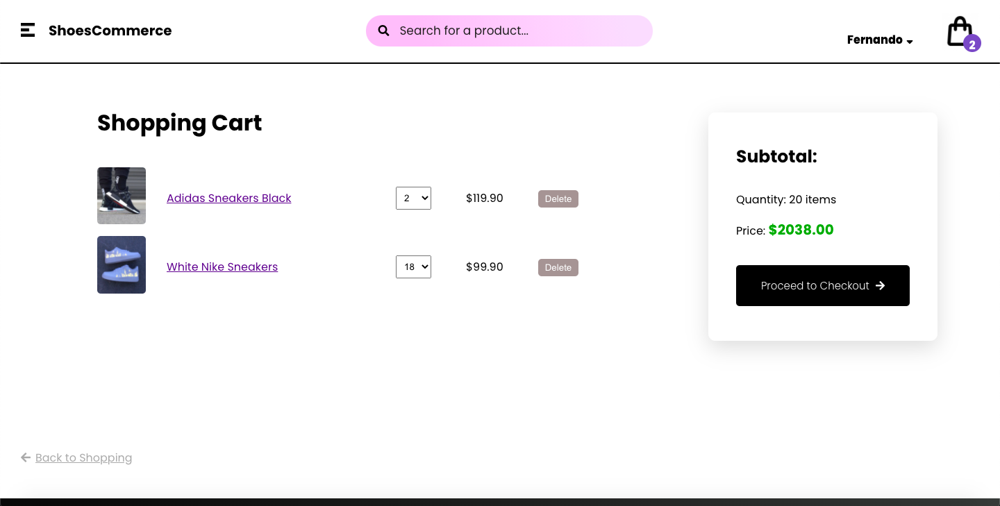
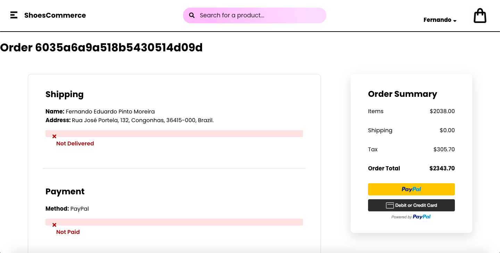

## Shoes Commerce (Not finished yet)

### Overview

Ecommerce platform to sell products, especifically shoes/sneakers. It was created with React and Redux in the Front-end and NodeJS in the Back-end. Redux was added to make the website more dynamic, in which it makes updatings in real time as the user clicks in add to cart, for instance, or when it updates his username and the name in the header changes right away. 

The first page shows all the products and the header, which contains a search box that has not been implemented in the Back-end yet. In the header you can also access the pages of the items in the cart, order history, user data updating and a sign out action.
 

 
A little further down the page you find the products with th title, description, rating and the price and each one leads to its own page.
 

 
Clicking on a product will lead you to the main page of each product. You can select the quantity you want to buy:
 

 
Clicking on Add to Cart button will lead you to the checkout page, where you can remove a product or changes its quantity dynamically:
 

 
The payment page contains a review of the order, with the products that were in the cart, the address, the personal information and the payment method chosen by the customer. Furthermore, it has the paypal button that works perfectly according to the price. The customer has also the option to pay with Debit or Credit card:
 

This ecommerce website is still being constructed and some features are not implemented yet. A dashboard is being implementing by myself and very soon will be available, which will allow the ecommerce owner to add products to the store dynamically, in addition to check metrics and analytics about the platform. 